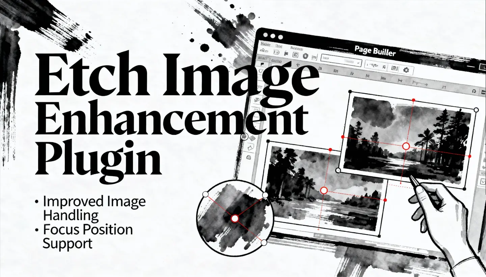

# MWE EtchWP Enhancements



A WordPress plugin that enhances the [Etch page builder](https://etchwp.com) with improved image handling and focus position support.

## Features

### 🖼️ Automatic Image Enhancement

Automatically enhances images in Etch blocks with essential attributes:

- **Responsive Images**: Adds `srcset` attributes for different screen sizes
- **Dimensions**: Extracts `width` and `height` from filename or metadata
- **Accessibility**: Adds `alt` text from attachment metadata
- **Performance**: Generates `sizes` attributes for optimal image loading
- **Smart Detection**: Only adds missing attributes, never overwrites existing ones

### 🎯 Focus Position Support

Integrates with focus point plugins to control image focal points:

- Applies CSS `object-position` based on focus point data
- Supports separate desktop and mobile focus positions
- Compatible with:
  - [Image Background Focus Position](https://www.wordpress-focalpoint.com/)
  - [Media Focus Point](https://wordpress.org/plugins/media-focus-point/)

## Requirements

### Required

- **Etch** page builder (v1.0.0-alpha-14 or higher)
- **PHP** 8.1 or higher
- **WordPress** 5.9 or higher

### Optional

For focus position features, install one of:
- Image Background Focus Position plugin
- Media Focus Point plugin

## Installation

1. Ensure Etch page builder is installed and activated
2. Upload the `mwe-etchwp-enhancements` folder to `/wp-content/plugins/`
3. Activate the plugin through the WordPress 'Plugins' menu
4. (Optional) Install a focus position plugin for focal point features

## Configuration

### Disable Features via Filters

Add to your theme's `functions.php`:

```php
// Disable image enhancement
add_filter( 'mwe_etchwp_enable_image_enhancement', '__return_false' );

// Disable focus position
add_filter( 'mwe_etchwp_enable_focus_position', '__return_false' );
```

### Disable Features via Constants

Add to `wp-config.php`:

```php
// Disable image enhancement
define( 'MWE_ETCHWP_IMAGE_ENHANCEMENT', false );

// Disable focus position
define( 'MWE_ETCHWP_FOCUS_POSITION', false );
```

## How It Works

### Image Enhancement Process

1. Hooks into `render_block` filter (priority 15) after Etch processes blocks
2. Detects `` tags in `etch/block` blocks
3. Attempts to find attachment ID from image URL
4. Checks which attributes are missing
5. Adds only the missing attributes without modifying existing ones

### Focus Position Process

1. Reads focus point data from compatible plugins
2. Adds data to attachment metadata via `wp_get_attachment_metadata` filter
3. Applies CSS `object-position` during block rendering
4. Determines desktop vs mobile position based on device detection
5. Automatically applies image enhancements as well

## Developer Documentation

### Available Filters

#### `mwe_etchwp_enable_image_enhancement`

Control whether image enhancement is enabled.

```php
/**
 * @param bool $enabled Default: true
 * @return bool
 */
apply_filters( 'mwe_etchwp_enable_image_enhancement', true );
```

#### `mwe_etchwp_enable_focus_position`

Control whether focus position feature is enabled.

```php
/**
 * @param bool $enabled Default: true
 * @return bool
 */
apply_filters( 'mwe_etchwp_enable_focus_position', true );
```

#### `mwe_etchwp_processable_blocks`

Customize which Etch block types are processed for image enhancement and focus position.

```php
/**
 * @param array $processable_blocks Default: ['etch/element', 'etch/dynamic-element', 'etch/raw-html', 'etch/component']
 * @return array
 */
apply_filters( 'mwe_etchwp_processable_blocks', $processable_blocks );
```

**Example usage:**

```php
// Add a custom block type to processing
add_filter( 'mwe_etchwp_processable_blocks', function( $blocks ) {
    $blocks[] = 'etch/custom-block';
    return $blocks;
} );

// Remove a specific block from processing
add_filter( 'mwe_etchwp_processable_blocks', function( $blocks ) {
    return array_diff( $blocks, array( 'etch/raw-html' ) );
} );
```

### Available Constants

#### `MWE_ETCHWP_IMAGE_ENHANCEMENT`

Enable/disable image enhancement feature.

```php
define( 'MWE_ETCHWP_IMAGE_ENHANCEMENT', false );
```

#### `MWE_ETCHWP_FOCUS_POSITION`

Enable/disable focus position feature.

```php
define( 'MWE_ETCHWP_FOCUS_POSITION', false );
```

### Class Architecture

```
MWE\EtchWP_Enhancements\
├── Plugin                    # Main plugin class with dependency checks
├── Image_Enhancement         # Handles image attribute enhancement
├── Focus_Position            # Handles focus point integration
└── Helper                    # Shared utility functions
```

All classes use the Singleton pattern and are autoloaded.

### Hook Priorities

- `render_block`: Priority 15 (runs after Etch at priority 10)
- `wp_get_attachment_metadata`: Priority 10
- `plugins_loaded`: Plugin initialization

## File Structure

```
mwe-etchwp-enhancements/
├── mwe-etchwp-enhancements.php    # Main plugin file
├── README.md                       # This file
├── readme.txt                      # WordPress.org readme
├── includes/
│   ├── class-plugin.php           # Main plugin class
│   ├── class-image-enhancement.php # Image enhancement feature
│   ├── class-focus-position.php   # Focus position feature
│   └── class-helper.php           # Shared utilities
└── languages/
    └── mwe-etchwp-enhancements.pot # Translation template
```

## WordPress Coding Standards

This plugin follows:
- [WordPress PHP Coding Standards](https://developer.wordpress.org/coding-standards/wordpress-coding-standards/php/)
- [WordPress Documentation Standards](https://developer.wordpress.org/coding-standards/inline-documentation-standards/php/)
- PSR-4 autoloading with namespace `MWE\EtchWP_Enhancements`
- Strict typing with `declare(strict_types=1)`

## Changelog

### 1.0.2 - 2025
- **Fixed:** Focus Position feature now initializes correctly regardless of plugin detection timing
- **Fixed:** Removed dependency check that prevented Focus Position from working in some cases
- **Improved:** Feature detection now happens at runtime instead of during initialization

### 1.0.1 - 2025
- **Fixed:** Updated block type detection for Etch compatibility
- **Changed:** Now supports `etch/element`, `etch/dynamic-element`, `etch/raw-html`, and `etch/component` blocks
- **Added:** New filter `mwe_etchwp_processable_blocks` to customize which block types are processed
- **Removed:** Support for legacy `etch/block` (no longer exists in current Etch versions)
- **Improved:** Better code documentation and centralized block detection logic

### 1.0.0 - 2025
- Initial release
- Image enhancement with automatic srcset, dimensions, alt, and sizes
- Focus position integration for compatible plugins
- Dependency checking with admin notices
- Filters and constants for feature control

## Credits

**Author:** Marco Michely
**Website:** [www.michelyweb.de](https://www.michelyweb.de)
**Email:** email@michelyweb.de

## License

This plugin is licensed under the GPL v3 or later.

```
Copyright (C) 2025 Marco Michely

This program is free software: you can redistribute it and/or modify
it under the terms of the GNU General Public License as published by
the Free Software Foundation, either version 3 of the License, or
(at your option) any later version.

This program is distributed in the hope that it will be useful,
but WITHOUT ANY WARRANTY; without even the implied warranty of
MERCHANTABILITY or FITNESS FOR A PARTICULAR PURPOSE. See the
GNU General Public License for more details.

You should have received a copy of the GNU General Public License
along with this program. If not, see <http://www.gnu.org/licenses/>.
```

## Support

For bug reports and feature requests, please contact:
- Email: email@michelyweb.de
- Website: https://www.michelyweb.de

---

Made with ❤️ by Marco Michely
