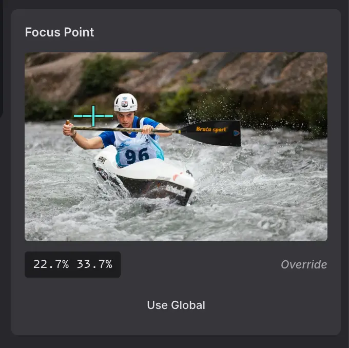

# MWE EtchWP Enhancements


A WordPress plugin that enhances the [Etch page builder](https://etchwp.com) with improved image handling and focus position support.

## Features

### 🖼️ Automatic Image Enhancement

Automatically enhances images in Etch blocks with essential attributes:

- **Responsive Images**: Adds `srcset` attributes for different screen sizes
- **Dimensions**: Extracts `width` and `height` from filename or metadata
- **Accessibility**: Adds `alt` text from attachment metadata
- **Decorative Images**: Use `alt="-"` (hyphen) to mark images as decorative
- **Performance**: Generates `sizes` attributes for optimal image loading
- **Smart Detection**: Only adds missing attributes, never overwrites existing ones
- **Optimized**: Early-exit for images with complete attributes (minimal overhead)
- **Efficient**: Runtime cache prevents duplicate database queries

### 🎯 Focus Position Support

Integrates with focus point plugins to control image focal points:

- Applies CSS `object-position` based on focus point data
- **Per-page overrides**: Set custom focus points in Etch editor that override global Media Library values
- **Visual editor**: Click-to-set focus point UI in Etch's element settings panel
- **Dynamic Data integration**: Access focus points via `{this.image.focusPoint}` in Etch templates
- Compatible with:
  - [Image Background Focus Position](https://www.wordpress-focalpoint.com/)
  - [Media Focus Point](https://wordpress.org/plugins/media-focus-point/)

#### Visual Focus Point Editor in Etch



The Focus Point Editor appears automatically when you select an image in the Etch canvas. It provides:

- **Interactive Preview**: Click anywhere on the image thumbnail to set the focus point
- **Visual Marker**: A crosshair marker shows the current focus position
- **Position Display**: Shows exact percentage values (e.g., "30.5% 45.2%")
- **Override Indicator**: Clearly shows whether you're using a page-specific override or the global Media Library value
- **Reset Button**: One click to remove the override and revert to the global focus point

## Requirements

### Required

- **Etch** page builder (v1.0.0-alpha-14 or higher)
- **PHP** 8.1 or higher
- **WordPress** 5.9 or higher

### Optional

For focus position features, install one of:
- Image Background Focus Position plugin
- Media Focus Point plugin

## Installation

1. Ensure Etch page builder is installed and activated
2. Upload the `mwe-etchwp-enhancements` folder to `/wp-content/plugins/`
3. Activate the plugin through the WordPress 'Plugins' menu
4. (Optional) Install a focus position plugin for focal point features

## Configuration

### Disable Features via Filters

Add to your theme's `functions.php`:

```php
// Disable image enhancement
add_filter( 'mwe_etchwp_enable_image_enhancement', '__return_false' );

// Disable focus position
add_filter( 'mwe_etchwp_enable_focus_position', '__return_false' );
```

### Disable Features via Constants

Add to `wp-config.php`:

```php
// Disable image enhancement
define( 'MWE_ETCHWP_IMAGE_ENHANCEMENT', false );

// Disable focus position
define( 'MWE_ETCHWP_FOCUS_POSITION', false );
```

## How It Works

### Image Enhancement Process

1. Hooks into `render_block` filter (priority 15) after Etch processes blocks
2. Detects `` tags in Etch blocks (element, component, dynamic-element, raw-html)
3. **Performance check**: Skips images that already have all attributes (early-exit)
4. **Cache check**: Returns cached attachment ID if image was previously processed
5. Attempts to find attachment ID from image URL using multiple strategies
6. Checks which attributes are missing
7. Adds only the missing attributes without modifying existing ones
8. **Caches result**: Stores attachment ID for future lookups within the same request

### Focus Position Process

1. Reads focus point data from compatible plugins
2. Adds data to attachment metadata via `wp_get_attachment_metadata` filter
3. Checks for per-page overrides stored in post meta
4. Applies CSS `object-position` during block rendering (override > global > default)
5. Automatically applies image enhancements as well

### Per-Page Focus Point Overrides

Focus points can be customized per-page in the Etch editor:

1. Select an image in the Etch canvas
2. Find the "Focus Point" section in Element Settings
3. Click on the preview image to set the focus point
4. The override is saved automatically for this page only
5. Click "Use Global" to remove the override and use the Media Library value

**Priority order:**
1. Per-page override (set in Etch editor)
2. Media Library focus point (global)
3. Default: `50% 50%` (center)

## Developer Documentation

### Available Filters

#### `mwe_etchwp_enable_image_enhancement`

Control whether image enhancement is enabled.

```php
/**
 * @param bool $enabled Default: true
 * @return bool
 */
apply_filters( 'mwe_etchwp_enable_image_enhancement', true );
```

#### `mwe_etchwp_enable_focus_position`

Control whether focus position feature is enabled.

```php
/**
 * @param bool $enabled Default: true
 * @return bool
 */
apply_filters( 'mwe_etchwp_enable_focus_position', true );
```

#### `mwe_etchwp_processable_blocks`

Customize which Etch block types are processed for image enhancement and focus position.

```php
/**
 * @param array $processable_blocks Default: ['etch/element', 'etch/dynamic-element', 'etch/raw-html', 'etch/component']
 * @return array
 */
apply_filters( 'mwe_etchwp_processable_blocks', $processable_blocks );
```

**Example usage:**

```php
// Add a custom block type to processing
add_filter( 'mwe_etchwp_processable_blocks', function( $blocks ) {
    $blocks[] = 'etch/custom-block';
    return $blocks;
} );

// Remove a specific block from processing
add_filter( 'mwe_etchwp_processable_blocks', function( $blocks ) {
    return array_diff( $blocks, array( 'etch/raw-html' ) );
} );
```

### Available Constants

#### `MWE_ETCHWP_IMAGE_ENHANCEMENT`

Enable/disable image enhancement feature.

```php
define( 'MWE_ETCHWP_IMAGE_ENHANCEMENT', false );
```

#### `MWE_ETCHWP_FOCUS_POSITION`

Enable/disable focus position feature.

```php
define( 'MWE_ETCHWP_FOCUS_POSITION', false );
```

### Class Architecture

```
MWE\EtchWP_Enhancements\
├── Plugin                    # Main plugin class with dependency checks
├── Image_Enhancement         # Handles image attribute enhancement
├── Focus_Position            # Handles focus point integration
├── Focus_Dynamic_Data        # Exposes focus points in Etch Dynamic Data
├── Focus_Ajax                # AJAX handlers for focus point overrides
├── Focus_Editor_UI           # Loads focus point editor UI in Etch canvas
└── Helper                    # Shared utility functions
```

All classes use the Singleton pattern and are autoloaded.

### Hook Priorities

- `render_block`: Priority 15 (runs after Etch at priority 10)
- `wp_get_attachment_metadata`: Priority 10
- `plugins_loaded`: Plugin initialization

## File Structure

```
mwe-etchwp-enhancements/
├── mwe-etchwp-enhancements.php       # Main plugin file
├── README.md                          # This file
├── readme.txt                         # WordPress.org readme
├── includes/
│   ├── class-plugin.php              # Main plugin class
│   ├── class-image-enhancement.php   # Image enhancement feature
│   ├── class-focus-position.php      # Focus position feature
│   ├── class-focus-dynamic-data.php  # Etch Dynamic Data integration
│   ├── class-focus-ajax.php          # AJAX handlers for overrides
│   ├── class-focus-editor-ui.php     # Editor UI asset loading
│   └── class-helper.php              # Shared utilities
├── assets/
│   ├── js/
│   │   └── focus-point-editor.js     # Visual focus point editor
│   └── css/
│       └── focus-point-editor.css    # Editor UI styles
└── languages/
    └── mwe-etchwp-enhancements.pot   # Translation template
```

## WordPress Coding Standards

This plugin follows:
- [WordPress PHP Coding Standards](https://developer.wordpress.org/coding-standards/wordpress-coding-standards/php/)
- [WordPress Documentation Standards](https://developer.wordpress.org/coding-standards/inline-documentation-standards/php/)
- PSR-4 autoloading with namespace `MWE\EtchWP_Enhancements`
- Strict typing with `declare(strict_types=1)`

## Changelog

### 1.1.0 - 2025
- **Added:** Per-page focus point overrides in Etch editor
- **Added:** Visual focus point editor UI with click-to-set functionality
- **Added:** Dynamic Data integration (`{this.image.focusPoint}` in Etch templates)
- **Added:** AJAX endpoints for saving/retrieving focus point overrides
- **Added:** Focus overrides stored in post meta (`_mwe_etchwp_enhancements_focus_overrides`)
- **Added:** New classes: `Focus_Dynamic_Data`, `Focus_Ajax`, `Focus_Editor_UI`
- **Changed:** Focus points now use priority: per-page override > Media Library > default

### 1.0.7 - 2025
- **Fixed:** Decorative images were being overwritten by Focus_Position filter
- **Added:** `data-decorative="true"` attribute to prevent re-processing

### 1.0.6 - 2025
- **Fixed:** Sizes attribute was not added when srcset already existed (inverted logic)
- **Changed:** New decorative image handling - use `alt="-"` (hyphen) to mark images as decorative
- **Changed:** Empty `alt=""` now loads alt text from media library (previously kept empty)

### 1.0.5 - 2025
- **Fixed:** Substring matching bug in attachment lookup that caused wrong srcset URLs (e.g., "Lang.webp" incorrectly matching "franz-jascha-lang.webp")
- **Improved:** Performance optimization - images with complete attributes are now skipped (no database queries)
- **Improved:** Runtime cache prevents duplicate database lookups for the same image within a request
- **Improved:** More precise attachment ID matching with exact filename comparison

### 1.0.2 - 2025
- **Fixed:** Focus Position feature now initializes correctly regardless of plugin detection timing
- **Fixed:** Removed dependency check that prevented Focus Position from working in some cases
- **Improved:** Feature detection now happens at runtime instead of during initialization

### 1.0.1 - 2025
- **Fixed:** Updated block type detection for Etch compatibility
- **Changed:** Now supports `etch/element`, `etch/dynamic-element`, `etch/raw-html`, and `etch/component` blocks
- **Added:** New filter `mwe_etchwp_processable_blocks` to customize which block types are processed
- **Removed:** Support for legacy `etch/block` (no longer exists in current Etch versions)
- **Improved:** Better code documentation and centralized block detection logic

### 1.0.0 - 2025
- Initial release
- Image enhancement with automatic srcset, dimensions, alt, and sizes
- Focus position integration for compatible plugins
- Dependency checking with admin notices
- Filters and constants for feature control

## Credits

**Author:** Marco Michely
**Website:** [www.michelyweb.de](https://www.michelyweb.de)
**Email:** email@michelyweb.de

## License

This plugin is licensed under the GPL v3 or later.

```
Copyright (C) 2025 Marco Michely

This program is free software: you can redistribute it and/or modify
it under the terms of the GNU General Public License as published by
the Free Software Foundation, either version 3 of the License, or
(at your option) any later version.

This program is distributed in the hope that it will be useful,
but WITHOUT ANY WARRANTY; without even the implied warranty of
MERCHANTABILITY or FITNESS FOR A PARTICULAR PURPOSE. See the
GNU General Public License for more details.

You should have received a copy of the GNU General Public License
along with this program. If not, see <http://www.gnu.org/licenses/>.
```

## Support

For bug reports and feature requests, please contact:
- Email: email@michelyweb.de
- Website: https://www.michelyweb.de

---

Made with ❤️ by Marco Michely
